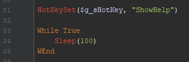
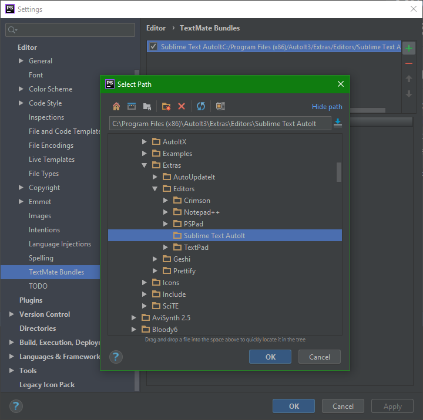
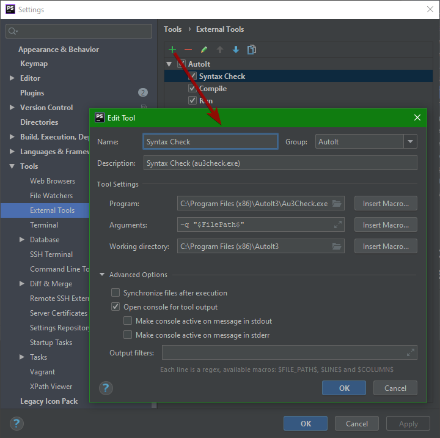
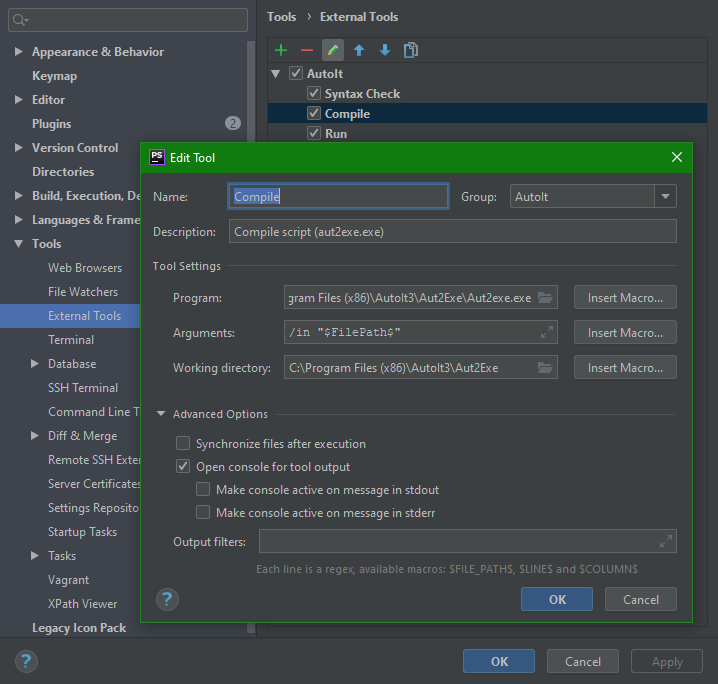
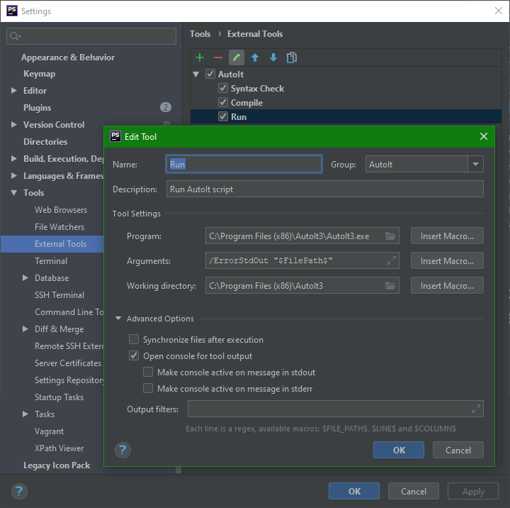
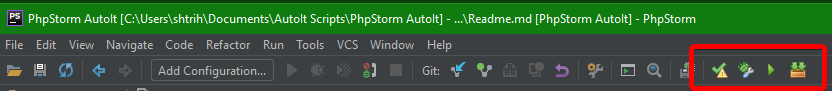
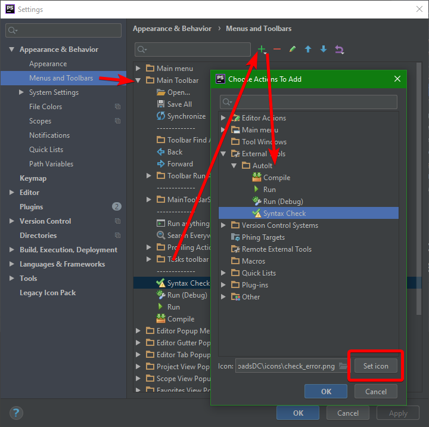

# Use Intellij IDE (or PhpStorm in my case) to write AutoIt scripts

## Enabling syntax highlighting

1. Open TextMate Bundles window in PhpStorm: `File | Settings | Editor | TextMate Bundles` (https://www.jetbrains.com/help/idea/2020.2/textmate-bundles.html).
2. Add AutoIt bundle for Sublime Text editor. It's located in `Extras` folder of AutoIt installation: 
`C:\Program Files (x86)\AutoIt3\Extras\Editors\Sublime Text`

## Adding AutoIt actions (Run, Syntax Check, etc.) 

1. Open `File | Settings | Tools | External Tools`
2. Add some actions to `AutoIt` group:

Now you can run opened AutoIt script from `Tools` menu:

## Adding buttons on toolbar

1. Open `File | Settings | Appearance & Behavior | Menus and Toolbars` (https://www.jetbrains.com/help/idea/2020.2/menus-and-toolbars-appearance-settings.html).
2. Add new action on `Main toolbar`. Chose action in `External tools` submenu. Set icons for actions. I use [FamFamFam Silk Icons](http://famfamfam.com/lab/icons/silk/).

## How to map hotkey (e.g. F1) in PhpStorm to open AutoIt documentation for the word under the keyboard cursor

Run AutoIt script `AutoIt-Help-Hotkey-for-IntellijIDE.au3`. On first run it creates ini file with settings. By default it uses hotkey `Ctrl+Q` to open help file. Maybe you need adjust path to AutoIt installation.
